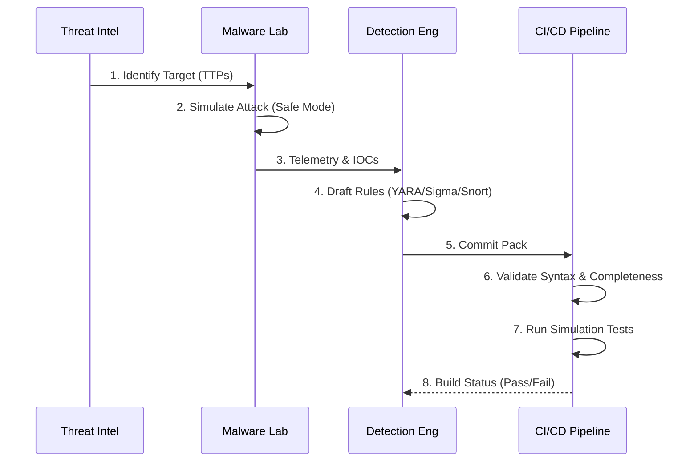

# Detection Lab: Middle East APT Focus

**Mission**: A public, enterprise-credible portfolio demonstrating "Intel-to-Detection" capabilities. This repository contains structured intelligence, detection resources (YARA, Sigma, Suricata), and validation logic for simulating and detecting advanced tradecraft in a high-fidelity F500 financial environment.

> [!CAUTION]
> **Safety Disclosure**: This repository contains references to real-world malware tradecraft. While no live malware binaries are stored here, the detection logic and traffic patterns faithfully simulate malicious behavior. Use with caution and only in isolated test environments.

## Engineering Pipeline

The detection engineering lifecycle is enforced via CI/CD to ensure high-fidelity outputs.

## Repository Structure

* **`packs/`**: Atomic units of intelligence and detection.
  * **[`muddywater-powerton`](packs/muddywater-powerton/brief.md)**: Sprint 1 - Initial Access (LNK/PowerShell).
  * **[`muddywater-exchange-cloud`](packs/muddywater-exchange-cloud/brief.md)**: Sprint 2 - Cloud Persistence & Tunneling.
  * **[`muddywater-bibiwiper`](packs/muddywater-bibiwiper/brief.md)**: Sprint 3 - Destructive Wiper Tradecraft.
* **`library/`**: Shared detection logic and reusable rules.
* **`docs/`**: Governance documents.
  * **[Threat Actor Profile: MuddyWater](docs/intel/muddywater.md)**
  * [Detection Engineering Playbook](docs/de_playbook.md)
  * [Lab Safety Policy](docs/lab_setup.md)
* **`reports/`**: Safe artifacts generated from analysis (strings, metadata, sterilized logs).

## Usage

1. **View Intelligence**: Start with the `packs/` directory to read Threat Actor Briefs.
2. **Deploy Detections**: Use the `.yml` (Sigma) or `.yar` (YARA) files in your SIEM/Scanner.
3. **Validate**: Run the provided test scripts in a safe VM to verify detection coverage.

## Project Status

* **Focus**: Middle East-themed APTs
* **Environment**: Simulated F500 Financial (Hybrid On-prem/Cloud)
* **Maintenance**: active
